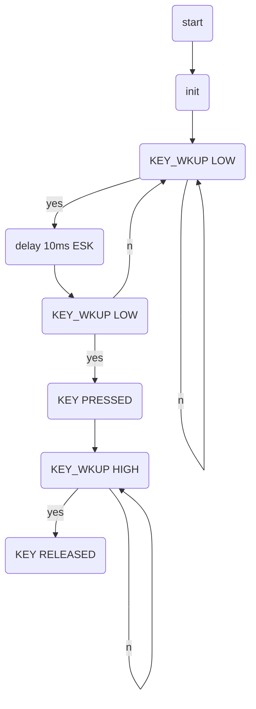

```mermaid
graph TB
t1(start)-->t2(init)
t2-->t3(KEY_WKUP LOW)
t3--yes-->t4(delay 10ms ESK)
t3--no-->t3
t4-->t5(KEY_WKUP LOW)
t5--yes-->t6(KEY PRESSED)
t5--no-->t3
t6-->t7(KEY_WKUP HIGH)
t7--yes-->t8(KEY RELEASED)
t7--no-->t7
```

