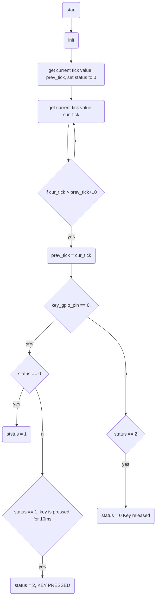

```mermaid
graph TB
t1(start)
t1-->t2(init)
t2-->t3(get current tick value: prev_tick, set status to 0 )
t3-->t4(get current tick value: cur_tick)
t4-->t5{if cur_tick > prev_tick+10}
t5--no-->t4
t5--yes-->t6(prev_tick = cur_tick)
t6-->t7{key_gpio_pin == 0, }
t7--yes-->t8{status == 0}
t8--yes-->t9(ststus = 1)
t8--no-->t10{status == 1, key is pressed for 10ms}
t7--no-->t11{status == 2}
t11--yes-->t12(status = 0 Key released)
t10--yes-->t13(status = 2, KEY PRESSED)

```

